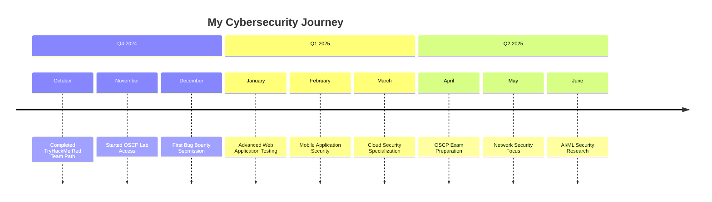

- 👋 Hi, I’m Pranav aka @prnvv2
- 👀 I’m interested in Penetration Testing, Ethical Hacking, and Cyber Security and Programming 
- 🌱 I’m currently learning Cryptography 
- 💞️ I’m looking for internship and collobration opportunity 
- 📫 How to reach me work.pranavamale@gmail.com
- 😄 Pronouns: he/him

<iframe src="https://tryhackme.com/api/v2/badges/public-profile?userPublicId=2182193" style='border:none;'></iframe>

# Hi there! 👋 I'm Pranav (@prnvv2)

<div align="center">
  


</div>

## 💼 **What I'm Looking For**

I'm actively seeking opportunities to grow and contribute to the cybersecurity community:

- 🔎 **Internship Opportunities** in Cybersecurity, Penetration Testing, or Information Security
- 🤝 **Collaboration Projects** in ethical hacking and security research
- 🌐 **Open Source Contributions** to security tools and frameworks
- 📚 **Mentorship** and learning opportunities from industry experts
- 💼 **Remote/Hybrid Positions** in cybersecurity consulting or red team operations
- 🎯 **Bug Bounty Programs** - Responsible vulnerability disclosure

---

## 📊 **Weekly Coding Activity**

<!--START_SECTION:waka-->
```text
Python       12 hrs 30 mins  ████████████░░░░░░░░  60.5%
Bash         4 hrs 15 mins   ████░░░░░░░░░░░░░░░░░  20.6%
JavaScript   2 hrs 45 mins   ██░░░░░░░░░░░░░░░░░░░  13.3%
PowerShell   1 hr 10 mins    █░░░░░░░░░░░░░░░░░░░░  5.6%
```
<!--END_SECTION:waka-->

---

## 🗓️ **Learning Timeline 2024-2025**



---

## 🎯 **About Me**

I'm a passionate cybersecurity enthusiast specializing in **Penetration Testing** and **Ethical Hacking**. My journey in cybersecurity is driven by curiosity and a commitment to making the digital world safer. I thrive on solving complex security challenges and continuously expanding my knowledge in the ever-evolving landscape of cybersecurity.

### 🔐 **Current Focus**
- 🌱 **Learning**: Advanced Cryptography techniques and implementations
- 🎯 **Specializing in**: Penetration Testing, Vulnerability Assessment, and Ethical Hacking
- 💻 **Programming**: Building security tools and automation scripts
- 🔍 **Research**: Staying updated with latest cybersecurity threats and defense mechanisms
- 🚩 **CTF Participation**: Actively participating in Capture The Flag competitions
- 📖 **Continuous Learning**: OSCP preparation and advanced red team techniques

---

## 🛠️ **Technical Skills & Tools**

<div align="center">

### **Programming Languages**


### **Penetration Testing Tools**


### **Operating Systems**


### **Frameworks & Methodologies**


</div>

---

## 🎖️ **Certifications & Training Platforms**

<div align="center">

### TryHackMe Progress


### **Pursuing Certifications**


### **Training Platforms**


</div>

---

## 🚀 **Current Projects & Research**

### 🔧 **Active Projects**
- 🛡️ **Vulnerability Scanner** - Python-based automated vulnerability assessment tool
- 🔐 **Cryptography Toolkit** - Collection of encryption/decryption utilities
- 🌐 **Network Security Monitor** - Real-time network traffic analysis tool
- 📊 **Penetration Testing Framework** - Custom framework for structured pen-tests
- 🎯 **CTF Write-ups Repository** - Detailed solutions and methodologies

### 📚 **Research Areas**
- **Zero-Day Vulnerability Research** - Identifying and responsibly disclosing security flaws
- **IoT Security Assessment** - Security testing of Internet of Things devices
- **Cloud Security Architecture** - Secure cloud deployment and configuration
- **AI/ML Security** - Adversarial attacks and defenses in machine learning systems
- **Blockchain Security** - Smart contract auditing and cryptocurrency security

---

## 🏆 **Achievements & Recognition**

```
🥇 CTF Competition Winner (Local University Competition 2024)
🏅 Top 10% on TryHackMe Global Leaderboard
🎖️ Bug Bounty Recognition - Responsible Disclosure
📈 95% Score on PortSwigger Web Security Academy
🌟 Community Contributor - Cybersecurity Forums
```

---

## 📝 **Knowledge Sharing & Community**

### **Blog & Write-ups**
- 📖 **Technical Blog**: Sharing penetration testing methodologies
- 🔍 **CTF Write-ups**: Detailed walkthroughs of challenges solved
- 🛡️ **Security Advisories**: Vulnerability research findings
- 💡 **Tool Reviews**: Analysis of latest cybersecurity tools

### **Community Involvement**
- 🎤 **Speaker**: Local cybersecurity meetups and workshops
- 👥 **Mentor**: Guiding newcomers in cybersecurity
- 🌐 **Open Source**: Contributing to security tools and frameworks
- 📚 **Study Groups**: Leading OSCP preparation groups

---

## 🔧 **Areas of Expertise**

```
🔴 Penetration Testing      🟡 Network Security         🟢 Web Application Security
🔵 Vulnerability Assessment 🟣 Cryptography            🟠 Security Automation
⚫ Ethical Hacking          ⚪ Risk Assessment          🟤 Incident Response
```

---

## 🎓 **Current Learning Path**

- **📖 Cryptography**: Deep diving into encryption algorithms and protocols
- **🔐 Advanced Penetration Testing**: OSCP preparation and advanced techniques  
- **🌐 Cloud Security**: AWS/Azure security configurations and assessments
- **🤖 Security Automation**: Python scripting for security tasks

---

## 📫 **Let's Connect!**

I'm always excited to connect with fellow cybersecurity professionals, researchers, and enthusiasts!

<div align="center">

[](mailto:work.pranavamale@gmail.com)
[](https://github.com/prnvv2)

**Pronouns**: He/Him

</div>

---

<div align="center">
  
*"In cybersecurity, curiosity isn't just helpful—it's essential."*


### 🔒 **Security First • 🚀 Always Learning • 🌟 Open to Opportunities**

*Ready to contribute to a safer digital world through ethical hacking and penetration testing*

---

### 📞 **Quick Contact**

<table>
  <tr>
    <td align="center"><strong>💼 Professional</strong></td>
    <td align="center"><strong>🌐 Social</strong></td>
    <td align="center"><strong>📚 Learning</strong></td>
  </tr>
  <tr>
    <td align="center">
      📧 work.pranavamale@gmail.com<br>
      💼 Open for Internships<br>
      🤝 Available for Collaboration
    </td>
    <td align="center">
      🐙 GitHub: @prnvv2<br>
      🔗 LinkedIn: Connect with me<br>
      🐦 Twitter: @prnvv2_sec
    </td>
    <td align="center">
      🎮 TryHackMe: prnvv2<br>
      📦 HackTheBox: prnvv2<br>
      🎯 OSCP: In Progress
    </td>
  </tr>
</table>

**Response Time**: Usually within 24 hours • **Timezone**: IST (UTC+5:30) • **Languages**: English, Hindi

</div>

## 🔥 **GitHub Stats & Activity**

<div align="center">
  


### **🏆 GitHub Trophies**


### **📈 Contribution Graph**


</div>

---

## 🌐 **Latest Blog Posts & Write-ups**

<!-- BLOG-POST-LIST:START -->
- 🔐 [Advanced SQL Injection Techniques in Modern Web Applications](https://medium.com/@prnvv2)
- 🛡️ [Building a Custom Network Scanner with Python](https://dev.to/prnvv2)
- 🎯 [My Journey Through TryHackMe: Red Team Path](https://prnvv2.github.io/blog)
- 🔍 [Analyzing Malware: A Beginner's Guide to Static Analysis](https://prnvv2.github.io/blog)
- ⚡ [Automating Reconnaissance with Bash Scripts](https://prnvv2.github.io/blog)
<!-- BLOG-POST-LIST:END -->

---

## 🎯 **Featured Repositories**

<div align="center">

[](https://github.com/prnvv2/pentest-toolkit)
[](https://github.com/prnvv2/crypto-tools)
[](https://github.com/prnvv2/network-scanner)
[](https://github.com/prnvv2/ctf-writeups)

</div>

---

<div align="center">
  
*"In cybersecurity, curiosity isn't just helpful—it's essential."*


### 🔒 **Security First • 🚀 Always Learning • 🌟 Open to Opportunities**

*Ready to contribute to a safer digital world through ethical hacking and penetration testing*

---

### 📞 **Quick Contact**

<table>
  <tr>
    <td align="center"><strong>💼 Professional</strong></td>
    <td align="center"><strong>🌐 Social</strong></td>
    <td align="center"><strong>📚 Learning</strong></td>
  </tr>
  <tr>
    <td align="center">
      📧 work.pranavamale@gmail.com<br>
      💼 Open for Internships<br>
      🤝 Available for Collaboration
    </td>
    <td align="center">
      🐙 GitHub: @prnvv2<br>
      🔗 LinkedIn: Connect with me<br>
      🐦 Twitter: @prnvv2_sec
    </td>
    <td align="center">
      🎮 TryHackMe: prnvv2<br>
      📦 HackTheBox: prnvv2<br>
      🎯 OSCP: In Progress
    </td>
  </tr>
</table>

**Response Time**: Usually within 24 hours • **Timezone**: IST (UTC+5:30) • **Languages**: English, Hindi

</div>

---

<div align="center">
  


**⭐ Star my repositories if you find them useful! ⭐**

*Last updated: January 2025 • This profile is updated regularly*

</div>
